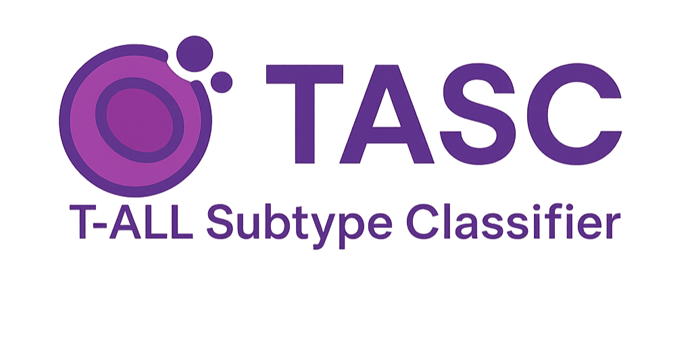
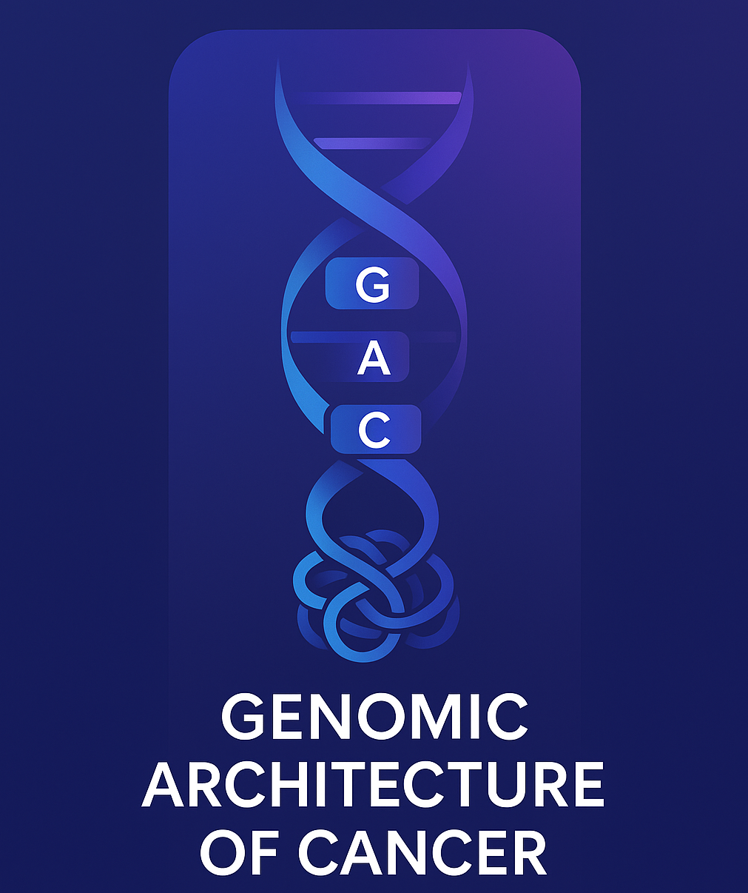
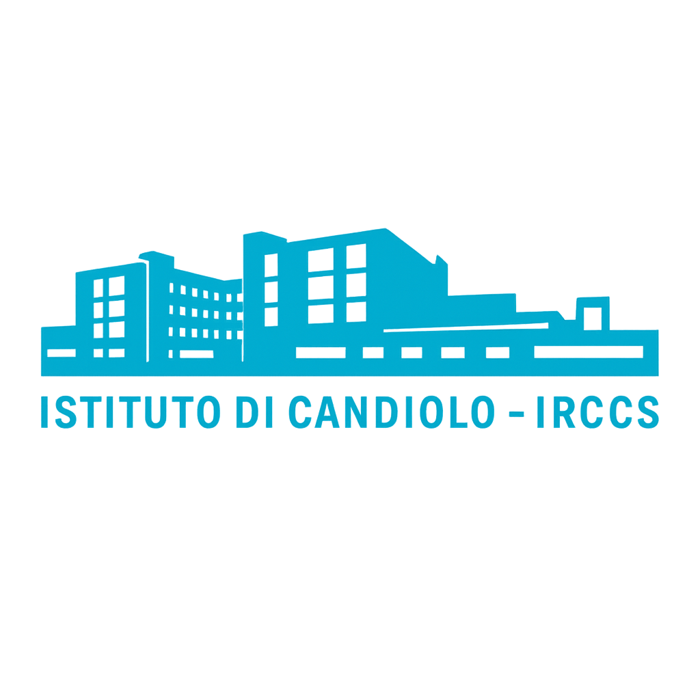

# TASC

## Get started
Run our ShinyApp for an interactive and reproducible framework to classify your T-ALL samples into multi-omic subtypes based on transcriptomic profiles. 
Check out our [Wiki](wiki.md) to learn how to run TASC interactively.

### Authors
[Cinzia Benetti](cinzia.benetti@ircc.com), [Omar Almolla](omar.almolla@ircc.com)

### Genomic Architecture of Cancer Lab
#### Dr. Francesco Boccalatte, PhD  

   Visit our
    <a href="www.link to website" target="_blank" style="text-decoration: none">
    website
    </a>
  
  

